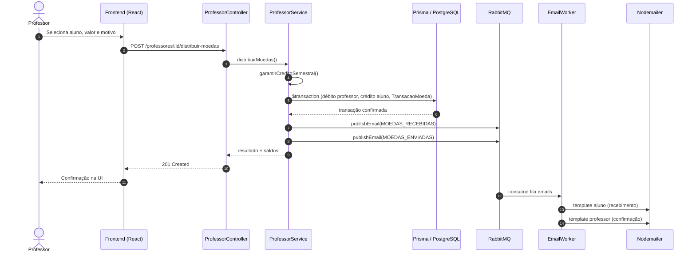

# UC01 — Envio de Moedas (Professor → Aluno)

```mermaid
sequenceDiagram
    autonumber
    actor Prof as Professor
    participant FE as Frontend (React)
    participant API as ProfessorController
    participant SVC as ProfessorService
    participant DB as Prisma / PostgreSQL
    participant Q as RabbitMQ
    participant W as EmailWorker
    participant SMTP as Nodemailer

    Prof->>FE: Seleciona aluno, valor e motivo
    FE->>API: POST /professores/:id/distribuir-moedas
    API->>SVC: distribuirMoedas()
    SVC->>SVC: garantirCreditoSemestral()
    SVC->>DB: $transaction (débito professor, crédito aluno, TransacaoMoeda)
    DB-->>SVC: transação confirmada
    SVC->>Q: publishEmail(MOEDAS_RECEBIDAS)
    SVC->>Q: publishEmail(MOEDAS_ENVIADAS)
    SVC-->>API: resultado + saldos
    API-->>FE: 201 Created
    FE-->>Prof: Confirmação na UI

    Q->>W: consume fila emails
    W->>SMTP: template aluno (recebimento)
    W->>SMTP: template professor (confirmação)
```
