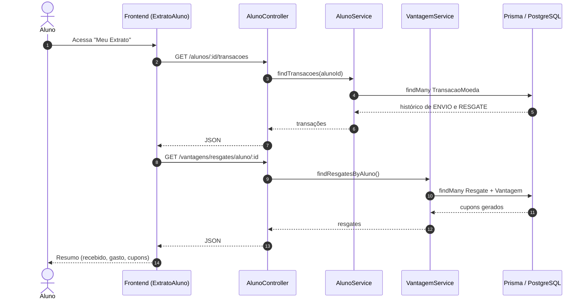

# UC02 — Consulta de Extrato do Aluno

```mermaid
sequenceDiagram
    autonumber
    actor Aluno
    participant FE as Frontend (ExtratoAluno)
    participant API as AlunoController
    participant SVC as AlunoService
    participant VSVC as VantagemService
    participant DB as Prisma / PostgreSQL

    Aluno->>FE: Acessa "Meu Extrato"
    FE->>API: GET /alunos/:id/transacoes
    API->>SVC: findTransacoes(alunoId)
    SVC->>DB: findMany TransacaoMoeda
    DB-->>SVC: histórico de ENVIO e RESGATE
    SVC-->>API: transações
    API-->>FE: JSON

    FE->>API: GET /vantagens/resgates/aluno/:id
    API->>VSVC: findResgatesByAluno()
    VSVC->>DB: findMany Resgate + Vantagem
    DB-->>VSVC: cupons gerados
    VSVC-->>API: resgates
    API-->>FE: JSON
    FE-->>Aluno: Resumo (recebido, gasto, cupons)
```
