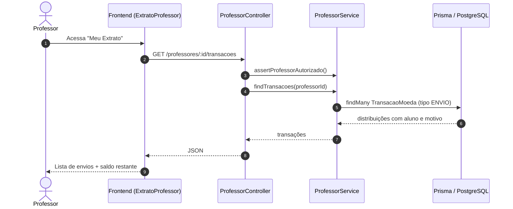

# UC03 — Consulta de Extrato do Professor

```mermaid
sequenceDiagram
    autonumber
    actor Prof as Professor
    participant FE as Frontend (ExtratoProfessor)
    participant API as ProfessorController
    participant SVC as ProfessorService
    participant DB as Prisma / PostgreSQL

    Prof->>FE: Acessa "Meu Extrato"
    FE->>API: GET /professores/:id/transacoes
    API->>SVC: assertProfessorAutorizado()
    API->>SVC: findTransacoes(professorId)
    SVC->>DB: findMany TransacaoMoeda (tipo ENVIO)
    DB-->>SVC: distribuições com aluno e motivo
    SVC-->>API: transações
    API-->>FE: JSON
    FE-->>Prof: Lista de envios + saldo restante
```
