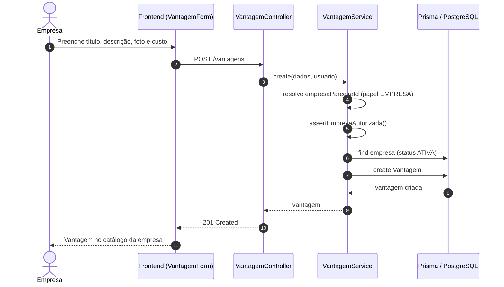

# UC04 — Cadastro de Vantagem (Empresa Parceira)

```mermaid
sequenceDiagram
    autonumber
    actor Emp as Empresa
    participant FE as Frontend (VantagemForm)
    participant API as VantagemController
    participant SVC as VantagemService
    participant DB as Prisma / PostgreSQL

    Emp->>FE: Preenche título, descrição, foto e custo
    FE->>API: POST /vantagens
    API->>SVC: create(dados, usuario)
    SVC->>SVC: resolve empresaParceiraId (papel EMPRESA)
    SVC->>SVC: assertEmpresaAutorizada()
    SVC->>DB: find empresa (status ATIVA)
    SVC->>DB: create Vantagem
    DB-->>SVC: vantagem criada
    SVC-->>API: vantagem
    API-->>FE: 201 Created
    FE-->>Emp: Vantagem no catálogo da empresa
```
