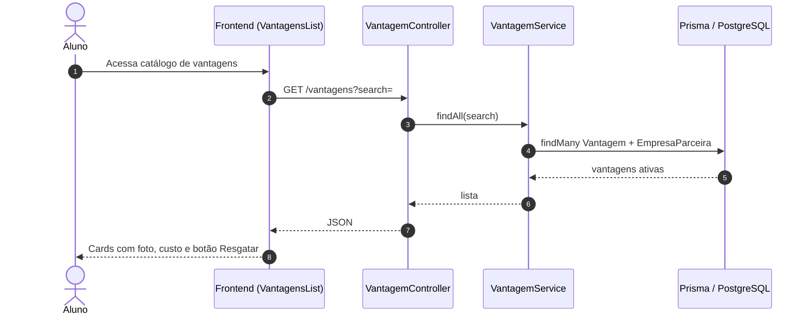

# UC05 — Listagem de Vantagens (Aluno)

```mermaid
sequenceDiagram
    autonumber
    actor Aluno
    participant FE as Frontend (VantagensList)
    participant API as VantagemController
    participant SVC as VantagemService
    participant DB as Prisma / PostgreSQL

    Aluno->>FE: Acessa catálogo de vantagens
    FE->>API: GET /vantagens?search=
    API->>SVC: findAll(search)
    SVC->>DB: findMany Vantagem + EmpresaParceira
    DB-->>SVC: vantagens ativas
    SVC-->>API: lista
    API-->>FE: JSON
    FE-->>Aluno: Cards com foto, custo e botão Resgatar
```
