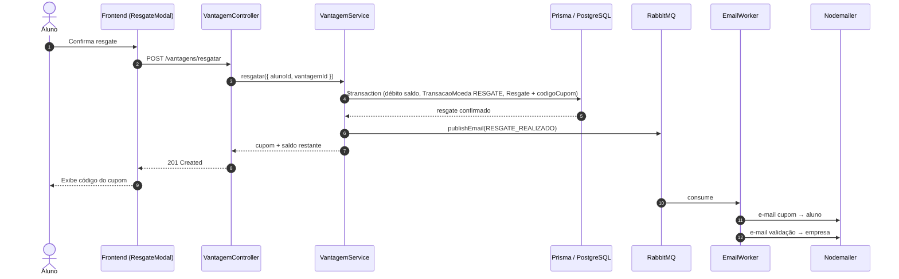

# UC06 — Resgate de Vantagem (Aluno)

```mermaid
sequenceDiagram
    autonumber
    actor Aluno
    participant FE as Frontend (ResgateModal)
    participant API as VantagemController
    participant SVC as VantagemService
    participant DB as Prisma / PostgreSQL
    participant Q as RabbitMQ
    participant W as EmailWorker
    participant SMTP as Nodemailer

    Aluno->>FE: Confirma resgate
    FE->>API: POST /vantagens/resgatar
    API->>SVC: resgatar({ alunoId, vantagemId })
    SVC->>DB: $transaction (débito saldo, TransacaoMoeda RESGATE, Resgate + codigoCupom)
    DB-->>SVC: resgate confirmado
    SVC->>Q: publishEmail(RESGATE_REALIZADO)
    SVC-->>API: cupom + saldo restante
    API-->>FE: 201 Created
    FE-->>Aluno: Exibe código do cupom

    Q->>W: consume
    W->>SMTP: e-mail cupom → aluno
    W->>SMTP: e-mail validação → empresa
```
