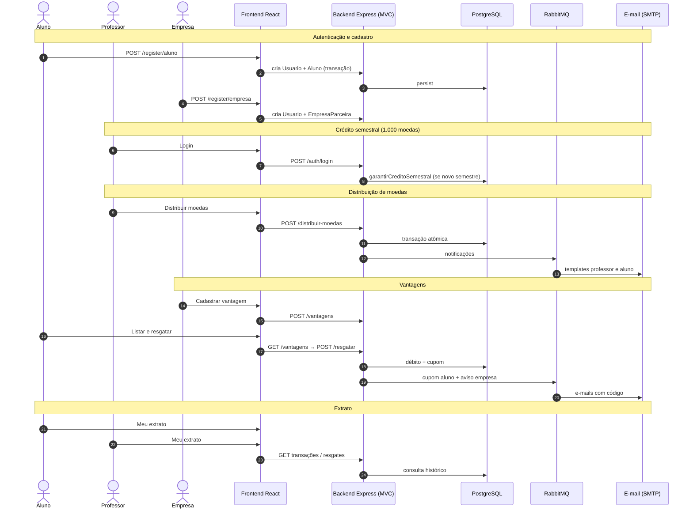

# UC07 — Diagrama de Sequência Geral

Visão integrada dos fluxos principais da Release 2.

```mermaid
sequenceDiagram
    autonumber
    actor Aluno
    actor Prof as Professor
    actor Emp as Empresa
    participant FE as Frontend React
    participant BE as Backend Express (MVC)
    participant DB as PostgreSQL
    participant MQ as RabbitMQ
    participant Mail as E-mail (SMTP)

    Note over Aluno,Mail: Autenticação e cadastro
    Aluno->>FE: POST /register/aluno
    FE->>BE: cria Usuario + Aluno (transação)
    BE->>DB: persist
    Emp->>FE: POST /register/empresa
    FE->>BE: cria Usuario + EmpresaParceira

    Note over Prof,Mail: Crédito semestral (1.000 moedas)
    Prof->>FE: Login
    FE->>BE: POST /auth/login
    BE->>DB: garantirCreditoSemestral (se novo semestre)

    Note over Prof,Mail: Distribuição de moedas
    Prof->>FE: Distribuir moedas
    FE->>BE: POST /distribuir-moedas
    BE->>DB: transação atômica
    BE->>MQ: notificações
    MQ->>Mail: templates professor e aluno

    Note over Emp,Mail: Vantagens
    Emp->>FE: Cadastrar vantagem
    FE->>BE: POST /vantagens
    Aluno->>FE: Listar e resgatar
    FE->>BE: GET /vantagens → POST /resgatar
    BE->>DB: débito + cupom
    BE->>MQ: cupom aluno + aviso empresa
    MQ->>Mail: e-mails com código

    Note over Aluno,Mail: Extrato
    Aluno->>FE: Meu extrato
    Prof->>FE: Meu extrato
    FE->>BE: GET transações / resgates
    BE->>DB: consulta histórico
```
